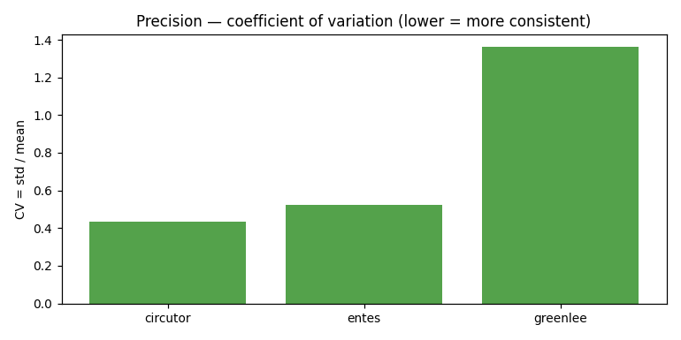
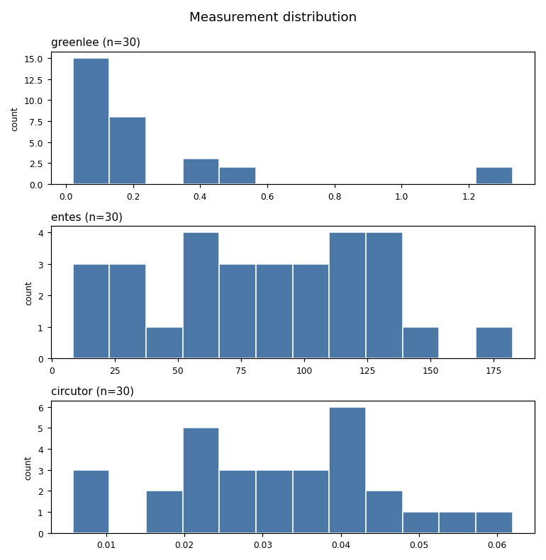
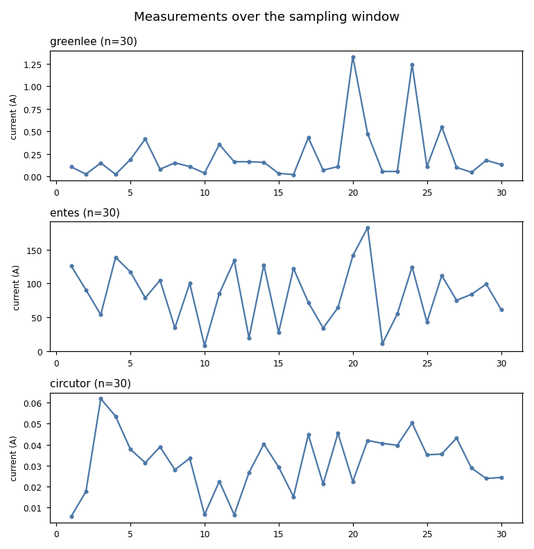

# Ammeter measurement & test framework

Three ammeter emulators — **Greenlee**, **ENTES**, **CIRCUTOR** — are provided as TCP socket
servers (one per device, each on its own thread and port). On top of them this project builds a
**config-driven measurement framework**: a unified API to sample any ammeter, configurable
sampling, statistical analysis, result archiving with retrieval/comparison, robust error
handling, and — as bonuses — precision assessment, visualization, and error simulation.

The emulators are treated as an **API/service under test**: a request/response contract over a
socket, with the same concerns as a REST/gRPC endpoint (connection setup, timeouts,
malformed-input handling, failure modes). The full brief is in
[`Exam/ammeter-test-specification.md`](Exam/ammeter-test-specification.md); the design rationale,
bug fixes, and installed libraries are in [`docs/design-decisions.md`](docs/design-decisions.md).

## How to run

Requires Python 3.9+.

```sh
# 1. Set up a virtualenv and install dependencies
python3 -m venv .venv
.venv/bin/pip install -r requirements.txt        # runtime (pyyaml, matplotlib)
.venv/bin/pip install -r requirements-dev.txt     # dev tools (pytest, pyright)

# 2. Run the framework — starts the emulators, samples each ammeter, prints a stats report,
#    archives the run, and writes plots
.venv/bin/python main.py
.venv/bin/python main.py --ammeter entes          # a single ammeter
.venv/bin/python main.py --verbose                # with per-measurement logging
.venv/bin/python main.py --no-save                # run without archiving the result
.venv/bin/python main.py --no-plot                # run without generating plots

# 3. Retrieve and compare archived runs (no emulators needed)
.venv/bin/python main.py --list                   # list archived run IDs
.venv/bin/python main.py --show <run_id>          # print one archived run
.venv/bin/python main.py --compare <run_a> <run_b>  # per-ammeter, per-stat deltas

# 4. Run the test suite / type-check
.venv/bin/pytest
.venv/bin/pyright
```

### With Docker

```sh
docker compose up --build --abort-on-container-exit --exit-code-from tests
```

Runs the emulators as a service and executes the full test suite against them.

### In CI (GitHub Actions)

- **CI** (`.github/workflows/ci.yml`) runs `pyright` + the full test suite on every push/PR.
- **Measurement showcase** (`.github/workflows/measure.yml`) is a manually-triggered workflow
  (Actions tab → *Measurement showcase* → *Run workflow*) that runs the framework in the
  pipeline: it takes two measurement campaigns, compares them, writes the comparison to the
  run summary, and uploads the result JSON and plots as a downloadable artifact. Because CI
  runners are ephemeral, results are preserved as an artifact rather than written back to the repo.

## The ammeters under test

Ports and commands are wired in `config/config.yaml` (kept in sync with the code registry by a
consistency test). The command protocol is **exact-match**: the emulator replies only if the
received bytes equal its command exactly.

| Ammeter  | Port | Command                                       | Measurement method          |
|----------|------|-----------------------------------------------|-----------------------------|
| Greenlee | 5001 | `MEASURE_GREENLEE -get_measurement`           | Ohm's law: I = V / R        |
| ENTES    | 5002 | `MEASURE_ENTES -get_data`                     | Hall effect: I = B · K      |
| CIRCUTOR | 5003 | `MEASURE_CIRCUTOR -get_measurement -current`  | Rogowski coil: I = ∫V dt    |

## Project structure

```
main.py                     CLI entry point: start emulators, run a campaign, archive, plot,
                            or answer a read-only --list/--show/--compare query
Ammeters/                   the provided emulators (fixed infrastructure)
  base_ammeter.py           AmmeterEmulatorBase: socket accept loop, readiness/stop, ports
  {Greenlee,Entes,Circutor}_Ammeter.py   the three concrete emulators
  client.py                 request_current_from_ammeter(): one measurement over a socket
src/testing/                the framework
  registry.py               single source of truth: name/class/port/expected range per ammeter
  settings.py               typed, validated view over config.yaml (fails fast on bad config)
  test_framework.py         AmmeterTestFramework: unified run_test() / run_all()
  sampling.py               fixed-rate sampling with monotonic pacing (no sleep drift)
  analysis.py               statistics (mean/median/std/min/max) via the stdlib
  results.py                TestResult / Statistics data model
  store.py                  ResultStore: JSON archive — save / load / list_runs / compare
  report.py                 human-readable tables (live + archived runs)
  precision.py              cross-ammeter precision (coefficient of variation) — bonus
  viz.py                    matplotlib plots (lazy-imported) — bonus
  fault_emulator.py         FaultInjectingEmulator for error-simulation tests — bonus
  assertions.py             the test "oracle": a closed set of assertion helpers
src/utils/                  config loader, logging setup, small helpers
config/config.yaml          ports, commands, sampling params, which statistics to report
tests/                      pytest suite (unit + integration tiers)
examples/run_tests.py       driving the framework programmatically (alternative to main.py)
docs/                       design-decisions.md, findings.md, handoff.md, sample-results/
.github/workflows/          ci.yml, measure.yml
Dockerfile, docker-compose.yml
```

Live output is git-ignored: archived runs go to `results/`, plots to `plots/`. A committed
sample of each lives under [`docs/sample-results/`](docs/sample-results/).

## Precision assessment (bonus)

After a campaign, the framework ranks the ammeters by **precision** — how *consistent* their
readings are — using the coefficient of variation (`std / mean`). Because it is scale-free, it
compares fairly across ammeters that read very different current ranges, and a lower value means
more consistent (more reliable) measurement. The ranking is printed after every run and also
shown by `python main.py --show <run_id>` for archived runs.

**Why precision and not accuracy:** true *accuracy* — closeness to the real current — is not
computable here. The emulators generate random values with **no ground-truth reference** to
compare against, so any "accuracy" figure would be invented. We report the consistency we can
actually measure, and label it honestly. (See `src/testing/precision.py`.)

## Visualization (bonus)

Each run also generates three plots (into `plots/`, named by run ID so they pair with the
archived JSON): a per-ammeter **histogram**, a per-ammeter **time-series**, and a **precision
bar chart**. `matplotlib` is imported lazily with the headless `Agg` backend, so read-only
commands and the test suite never pay for it. Disable with `--no-plot`.

The plots below are the sample run committed under
[`docs/sample-results/`](docs/sample-results/):

| Precision (CV per ammeter) | Distributions | Over the sampling window |
|---|---|---|
|  |  |  |

The per-ammeter charts use separate axes on purpose — the three ammeters read very different
current ranges (milliamps to hundreds of amps), so a shared axis would be unreadable.

## Error simulation (bonus)

To prove the framework *handles* faults, `src/testing/fault_emulator.py` provides a
`FaultInjectingEmulator` that misbehaves on purpose in four modes: **HANG** (never reply →
client timeout), **GARBAGE** (non-numeric reply), **DROP** (close without replying), and
**FLAKY** (intermittent). The error-simulation tests drive the real client / sampling loop /
framework against it and assert graceful degradation — a bad reading becomes one *counted
failure*, statistics are still computed from the good samples, and a fully-failing ammeter is
skipped rather than aborting the campaign.

This surfaced (and fixed) a real gap: the client did `float(reply)`, so a **corrupt reply**
raised `ValueError` and aborted the whole ammeter's run. The client now treats an unparseable
reply as a single failed measurement (`None`), consistent with how timeouts are handled.

**Design decision — why error simulation lives in the test tier, not a `main.py` flag.**
Error handling is a property of the framework, and the honest way to demonstrate it is to
exercise the real code paths against a real misbehaving socket and assert the outcome — which
then runs in **CI on every push**. A `--simulate-errors` demo flag would prove less (a reviewer
must remember to run it), add surface to `main.py`, and pollute the fixed emulator
infrastructure. Keeping fault injection in the tests keeps normal runs clean while still
proving the behaviour continuously.

## Testing

The suite is split into two tiers (pytest markers): **unit** tests for pure logic (statistics,
config, sampling pacing, formatting) and **integration** tests that talk to a real emulator over
an ephemeral socket. It includes security-minded negative tests (malformed / oversized / garbage
commands) and cheap policy gates (no sleep-based waits, no hard-coded ports). See
[`docs/design-decisions.md`](docs/design-decisions.md) for the testing conventions and
[`docs/findings.md`](docs/findings.md) for known robustness findings.
